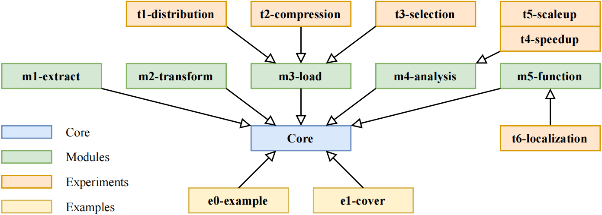

This thesis aims to design and implement a distributed database solution to enhance the management and querying of trajectory data.

# Code Structure Description

This readme gives the structure of all the code modules (the implementation and experiments).

*Figure: One box represents one module while the arrows represent the dependence relationship.*

## Core Module
The core module is highlighted in blue, which contains all the classes and functions that all the other modules rely on such as the function that is used to split the trajectory and the classes of the adaptive Octree.

## Implementation Modules
The implementation modules are highlighted in green, which contains the whole life cycle of the data. The first three modules deal with the extraction, transformation, and loading processes of the data. The fourth module deals with the analysis of the data spatial distribution which is used to create the adaptive Octree data structure. The final module deals with the definitions of all the SQL functions for the applications.

## Experiment Modules
The experiment modules are highlighted in orange, which contain the codes for experiments and visualizations shown in the Experiment and Validation chapter.

## Example Modules
The example modules are highlighted in yellow, which contain the codes to generate demos for the readers to better understand the concepts and methodologies. The diagrams of these demos are also used in the Theories and Concepts and Methodology chapters. The last module (e1-cover) is used to generate the cover of this thesis.
